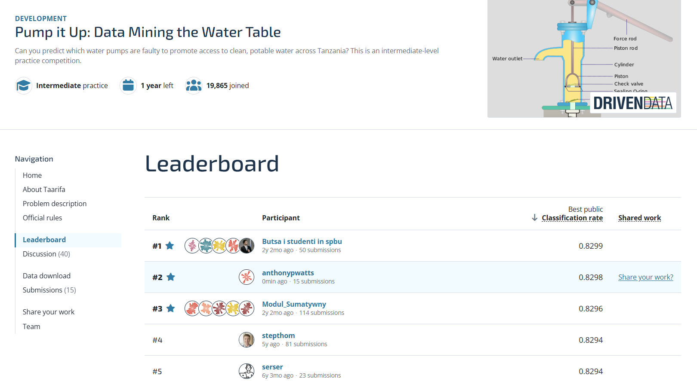

# Imperial ML and AI capstone

Coursework and portfolio work for the Imperial College London Professional
Certificate in Machine Learning and Artificial Intelligence.

## Project status

Stage 1 result snapshot: **5 September 2026**. Stage 2 resource intake: **24 September 2026**.

| Stage | Project | Status | Headline |
| --- | --- | --- | --- |
| 1 | [Pump It Up](stage-1-pump-it-up/) | Model search complete | Fresh CatBoost identity/spatial-grid bag scored **`0.8304`** publicly and was observed at leaderboard position **1** |
| 2 | [Black-box optimisation](stage-2-bbo/) | Initial data ready | Module 12 observations verified; 13 weekly query rounds confirmed |

The leaderboard position is a time-specific observation and may change as
other competitors submit.

## Project structure

| Area | Purpose |
| --- | --- |
| [`index.html`](index.html) | Static Capstone Hub joining the project stages and working tools |
| [`stage-1-pump-it-up/`](stage-1-pump-it-up/) | Multiclass classification using the DrivenData *Pump It Up* competition |
| [`stage-2-bbo/`](stage-2-bbo/) | Assessed black-box optimisation across eight unknown functions |
| [`dashboard/`](dashboard/) | Static plan and progress dashboard for Stage 1 |
| [`map/`](map/) | Browser-side map using locally selected Stage 1 training labels |

Stage 1 is a self-contained machine-learning project used to practise the
course workflow on a real operational problem. Stage 2 follows the course's
fixed BBO brief and will be developed as each set of observations is released.

## Stage 1: Pump It Up

The Stage 1 goal is to classify Tanzanian waterpoints as `functional`,
`functional needs repair` or `non functional` for the
[DrivenData *Pump It Up* competition](https://www.drivendata.org/competitions/7/pump-it-up-data-mining-the-water-table/).
Competition submissions are scored by multiclass accuracy.

### Current result

| Measure | Result |
| --- | --- |
| Data | 59,400 labelled rows and 14,850 competition rows |
| Predictors | 39 audited; 3 structural removals; 36 candidates retained for modelling |
| Public-leading model | Fresh CatBoost identity/spatial-grid 50:50 bag within the fixed CatBoost slot |
| Fresh five-fold OOF accuracy | **82.0522%** |
| Public leaderboard score | **`0.8304`** |
| Project target | `0.8260` |
| Observed public rank | **1** on 5 September 2026 |

[](https://www.drivendata.org/competitions/7/pump-it-up-data-mining-the-water-table/leaderboard/)

*Historical leaderboard evidence from 23 August 2026. The later rank-1 result
was observed live on 5 September 2026; rankings may change.*

Twenty-one submissions tested the end-to-end workflow. The current best score
exceeds the project target by `0.0044`.

### Model selection

The evaluation design used a fixed stratified 20% local test and five fixed
stratified development folds, with preprocessing fitted inside each training
fold. Candidate changes were assessed through bounded promotion gates rather
than open-ended leaderboard tuning.

The initial broad comparison found Random Forest to be the strongest single
model at 80.59% mean development accuracy. A later 55% XGBoost and 45% Random
Forest vote reached 81.6246% and became the reference for subsequent screens.
Those screens examined feature hierarchies, high-cardinality identities,
geographic robustness, imputation, class imbalance, regional specialists,
alternative target structures and additional ensemble members.

The changes that survived the evidence gates came from genuinely different
representations rather than small local adjustments. Ordered categorical
identity learning produced the first new promotion, followed by complementary
archive-derived categorical-frequency and spatial-height representations. The
fixed deep-XGBoost substitution improved the development, local-test and public
results in the same direction and established the previous `0.8298` best.

After three row-targeted repair submissions regressed publicly on 4 September,
a fresh all-label validation partition was used to distinguish a wrong model
path from adaptive overfit. Formal base-candidate ordering remained aligned
with public ordering, train-versus-competition shift was negligible, and the
historical local subset appeared only moderately harder. The evidence therefore
rejects further row-level postprocessing, not the base architecture. A locked,
non-adaptive three-file model-level slate then scored `0.8302`, `0.8304` and
`0.8303`; the identity/spatial-grid CatBoost bag became the new public leader.

### Main conclusions

| Question | Evidence-led conclusion |
| --- | --- |
| What did the categorical hierarchy screens retain? | Granular extraction, source, quality and waterpoint features survived the bounded comparisons. |
| Did minority oversampling improve the competition objective? | It raised repair recall but reduced overall accuracy. The frozen 2.5× bag scored `0.8174` publicly, so it remained an interpretation of the trade-off rather than the selected model. |
| Is geographic transfer a risk? | Yes. LGA-disjoint validation exposed a substantial accuracy and repair-recall drop even when centroid imputation helped four of five folds. |
| Where did the later gains come from? | Complete identities, categorical occurrence support, spatial-height reconstruction and the deeper XGBoost representation added complementary signal. |
| Were the late test-set regressions a broken test set or a wrong base path? | Neither is supported. Fresh validation and shift checks point to adaptive overfit in row-targeted repair rules; bounded architecture-level changes transferred positively. |
| Why stop? | The new public leader is supported by only a 13-row fresh-OOF gain and did not pass the formal promotion gate; further adaptive tuning would add more overfitting risk than useful evidence. |

### Evidence and reproducibility

- [Publication report](stage-1-pump-it-up/reports/publication/pump-it-up-model-development-report.docx)
  — course-aligned account of the complete model-development lifecycle.
- [Model-search conclusion](stage-1-pump-it-up/reports/model-search-conclusion.md)
  — final decision, lifecycle summary, result comparison and stop rationale.
- [Deep follow-up report](stage-1-pump-it-up/reports/deep-follow-up-search.md)
  — the previous deep-model seed comparison and `0.8298` submission.
- [Generalisation diagnosis](stage-1-pump-it-up/reports/generalisation-diagnosis.md)
  — fresh evidence separating model-path risk from adaptive overfit.
- [Fresh reconstruction and submission slate](stage-1-pump-it-up/reports/fresh-ensemble-reconstruction-and-submission-slate.md)
  — locked gates, reproducible portfolio, immutable hashes and public results.
- [Report index](stage-1-pump-it-up/reports/README.md) — all feature, model,
  robustness and interpretation experiments.
- [Submission log](stage-1-pump-it-up/submissions/README.md) — exact recipes,
  validation results, hashes and public scores.
- [Data-audit report](stage-1-pump-it-up/notebooks/data-audit/00-overall/00-overall-data-audit.md)
  — predictor-level findings and preparation decisions.

The [Stage 1 README](stage-1-pump-it-up/README.md) contains the detailed
working narrative and links to notebooks, source code and generated evidence.

## Stage 2: black-box optimisation

Stage 2 is scaffolded for the assessed task of maximising eight unknown
functions from sequential observations. Its workspace records the intended
Gaussian-process workflow, data constraints, proposed points and returned
values. The Module 12 observations are now available locally and verified;
the first modelling and query-selection round is the next step.

See the [Stage 2 README](stage-2-bbo/README.md) for the planned approach and
repository structure.

## Live project tools

- [Capstone Hub](https://anthonypwatts.github.io/imperial-capstone/)
- [Stage 1 dashboard](https://anthonypwatts.github.io/imperial-capstone/dashboard/)
- [Stage 1 training-label map](https://anthonypwatts.github.io/imperial-capstone/map/)
- [Stage 2 workspace](https://anthonypwatts.github.io/imperial-capstone/stage-2-bbo/)

The public pages load the non-sensitive status snapshot in
[`project-status.json`](project-status.json). Competition datasets remain
excluded from Git; visitors provide local copies through the map's file
pickers.

## Local setup

### Modelling environment

Create a project-local environment and install the recorded notebook and
scikit-learn runtime before running Stage 1 analyses:

```powershell
py -m venv .venv
.\.venv\Scripts\python.exe -m pip install -r requirements.txt
```

The competition CSV files must already be present under
`stage-1-pump-it-up/data/`; they remain excluded from Git.

### Static project hub

Run the site from the repository root so that the hub, shared status snapshot
and local-data map resolve from the same origin:

```powershell
python -m http.server 8000
```

Then open <http://localhost:8000/>.

## Working conventions

- Keep exploratory work in numbered notebooks.
- Move reusable code into `src/`.
- Record decisions and results rather than relying on notebook output alone.
- Do not commit competition downloads, supplied BBO observations or secrets.
- Prefer a simple, reproducible baseline before tuning more complex models.

Each stage README describes its immediate plan, detailed evidence and remaining
work.
