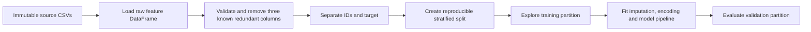

# Stage 1 data preparation: decisions and next steps

## Working on

Begin the baseline workflow by validating identifiers, aligning the target,
separating metadata from candidate predictors and creating a reproducible
stratified split. Deeper missing-value analysis and every learned transform must
use the training partition rather than the full labelled data.

The fixed column-removal implementation is in
[`src/data_preparation.py`](../src/data_preparation.py), with its declarative
schema and assumptions in
[`src/raw_feature_column_policy.json`](../src/raw_feature_column_policy.json).
The preserved prior overall audit at
[`10-prior-overall-data-audit.ipynb`](../notebooks/data-audit/00-overall/supporting-audits/10-prior-overall-data-audit.ipynb)
applies it independently to both raw feature frames and shows the 40 to 37
column change without altering the source DataFrames.

The notebook's reusable structure and identifier checks now live in
[`src/source_data_validation.py`](../src/source_data_validation.py). The notebook
keeps file loading, progress messages and one-off exploration; the module owns
only the reusable validations for raw feature schema, label-frame structure and
matching IDs. No stateful manager classes are needed for these operations.

## Course scope established on 14 August 2026

Stage 1, including the Pump It Up work, provides optional practice and portfolio
evidence. The course labels the Module 3 to 9 activities as self-study capstone
components, and the Module 6 introduction says that these activities do not count
towards programme completion. The overview also says elsewhere that Stage 1 runs
through Module 11, so the published boundaries conflict.

The required capstone begins in Module 12 with the shared black-box optimisation
challenge. Modules 12 to 24 require numeric queries and progress records. The
Module 25 submission asks for a GitHub repository containing runnable, commented
code, a data sheet, a model card, a non-technical write-up, a README linking to
large data rather than storing it, and relevant supporting material.

Later Stage 2 pages remain locked. The pages available at this date do not state
a minimum model score or formal quality threshold. They support a cautious
working interpretation: the course requires a complete, documented Stage 2
attempt; stronger results determine presentation or distinction opportunities.

Evidence:

- [Capstone project overview](https://classroom.emeritus.org/courses/18642/pages/capstone-project-overview?module_item_id=3236688)
- [Module 6 discussion](https://classroom.emeritus.org/courses/18642/discussion_topics/969793?module_item_id=3237005)
- [Course module list](https://classroom.emeritus.org/courses/18642/modules)

The Module 6 discussion post records the Stage 1 ambiguity and explains that
Pump It Up was selected as an interesting data set, rather than as a commitment
to enter the competition. Other learners reported similar uncertainty about
project choice.

## Evidence already collected

The audit area contains the current evidence and findings:

- [`00-overall-data-audit.md`](../notebooks/data-audit/00-overall/00-overall-data-audit.md)
  contains the findings, decisions, risks and full raw-predictor register.
- [`00-target-label-analysis.ipynb`](../notebooks/data-audit/00-target-label-analysis/00-target-label-analysis.ipynb)
  contains the focused initial target analysis.
- [`04-amount_tsh-deep-dive.ipynb`](../notebooks/data-audit/01-amount_tsh/04-amount_tsh-deep-dive.ipynb)
  preserves the earlier focused `amount_tsh` analysis alongside its canonical
  three-notebook audit.
- [`data-audit/README.md`](../notebooks/data-audit/README.md) indexes all 39 raw
  predictors, including the three proposed structural removals.

### Target label findings

`status_group` has one complete label for each of the 59,400 unique training IDs
and contains exactly the three documented classes:

| `status_group` | Rows | Share |
| --- | ---: | ---: |
| `functional` | 32,259 | 54.31% |
| `functional needs repair` | 4,317 | 7.27% |
| `non functional` | 22,824 | 38.42% |

An always-`functional` non-model would achieve 54.31% accuracy. The majority
class is 7.47 times the size of `functional needs repair`. Use a stratified
train/validation split, retain challenge accuracy as the primary comparison
measure and inspect the confusion matrix and per-class recall during diagnosis.
Do not apply oversampling or calculate class weights before the split.

The duplicate-column audit covered both feature files:

| Data set | Rows | Source columns |
| --- | ---: | ---: |
| Training values | 59,400 | 40 |
| Test values | 14,850 | 40 |

### Duplicate and near-duplicate findings

| Category | Finding in training data | Finding in test data | Decision |
| --- | --- | --- | --- |
| Duplicate column labels | None | None | No action |
| Same values, row for row | `quantity` equals `quantity_group` | Same result | Keep `quantity`; drop `quantity_group` |
| Same information under different labels | `payment` and `payment_type` form a one-to-one relabelling | Same result | Keep `payment_type`; drop `payment` |
| More than 99.5% one repeated value | `recorded_by` is 100% `GeoData Consultants Ltd` | Same result | Drop `recorded_by` |
| Other column pairs above 99.5% row agreement | None | None | No action |

The payment mapping was stable in both files:

| `payment` | `payment_type` |
| --- | --- |
| `pay annually` | `annually` |
| `pay monthly` | `monthly` |
| `pay per bucket` | `per bucket` |
| `pay when scheme fails` | `on failure` |
| `never pay` | `never pay` |
| `other` | `other` |
| `unknown` | `unknown` |

`extraction_type` and `extraction_type_group` had the highest remaining literal
agreement: 95.843% in training and 95.684% in test. This falls below the 99.5%
threshold. `num_private` contained zero for about 98.73% of training rows and
98.69% of test rows, so it also falls below the threshold.

Several column families encode deterministic hierarchies:

- extraction type, group and class;
- management and management group;
- water quality and quality group;
- source, source type and source class;
- waterpoint type and waterpoint group.

These hierarchies may help models at different levels of granularity. Keep them
until training-partition analysis or validated model comparisons justify a
removal.

## Settled structural policy

Apply the same fixed policy independently to any raw training or test feature
DataFrame:

| Source column | Treatment | Reason |
| --- | --- | --- |
| `quantity` | Keep | Preferred descriptive field |
| `quantity_group` | Drop | Row-for-row duplicate of `quantity` |
| `payment_type` | Keep | Preferred compact field |
| `payment` | Drop | One-to-one relabelling of `payment_type` |
| `recorded_by` | Drop | Constant in both supplied feature files |
| `id` | Preserve in the returned DataFrame | Required for later joins and competition submissions; exclude from predictors when the modelling workflow separates identifiers |

The column-removal function turns the 40 raw columns into 37 columns, including
`id`. It performs no identifier separation or modelling transformation. A later
workflow step will preserve `id` as metadata and pass the other 36 columns to
the model pipeline as candidate predictors.

## Pipeline boundary

The project will recreate canonical data from the untouched competition CSV
files on each run. Do not create or maintain cleaned CSV copies.

Structural preparation may inspect schema and agreed equivalence rules. It must
not calculate means, modes, frequencies, target correlations or other learned
statistics. Imputation, encoding and model transforms must fit on the training
partition or current cross-validation fold.

Generic duplicate and constant-column discovery belongs in an audit report. It
must not drop new columns from test data or change the feature policy without a
reviewed decision.

## Required safeguards

The column-removal function must stop with a clear error if any of these
conditions fails:

1. Required raw feature columns are missing, unexpected columns appear or a
   column label is duplicated.
2. `quantity` and `quantity_group` differ, including their missing-value pattern.
3. A `payment` value does not map to the expected `payment_type` value.
4. `recorded_by` contains a value other than the agreed constant.

The function must preserve row count, row order, `id` and the order of all
retained columns. It must not mutate the caller-owned DataFrame.

Identifier integrity, target alignment and matching training/test predictor
schemas remain necessary, but they belong to the later workflow that separates
metadata and constructs the modelling inputs. They are not responsibilities of
the fixed column-removal function.

## Fit with the course ten-step plan

The project uses the canonical course lifecycle while creating the split before
any learned preprocessing to prevent leakage.

| Course step | Project treatment |
| ---: | --- |
| 1. Define the goal and scope | Treat Stage 1 as practice and portfolio work. Predict three waterpoint states and use accuracy as the competition success measure. |
| 2. Gather the data | Load immutable feature and label files, join labels by `id` and retain provenance. |
| 3. Explore the data | Use the target analysis, maintained findings report and predictor catalogue to cover structure, distributions, relationships and limitations. |
| 4. Clean and preprocess the data | Apply the three guarded structural removals. Fit missing-value handling, encoding and any scaling inside the training partition or current fold. |
| 5. Select and engineer features | Start with 36 candidates. Test provisional date, age, availability, coordinate and category treatments through held-out comparisons and ablations. |
| 6. Define the machine-learning task | Record multiclass classification, challenge accuracy, class imbalance and the diagnostic measures needed for the minority class. |
| 7. Partition the data | Freeze a reproducible stratified split and add a grouped geographic sensitivity check. This is the next formal gate. |
| 8. Select and train candidate methods | Recreate Extra Trees, histogram gradient boosting and their soft vote with fold-fitted preprocessing; include the non-model reference and a transparent baseline. |
| 9. Evaluate and interpret the results | Compare held-out accuracy, per-class recall and the confusion matrix before using public scores for model selection. |
| 10. Deploy and iterate | Refit the selected workflow, validate the submission, record its score and return to earlier steps when errors or ablations justify a change. |

The lifecycle remains iterative. Early public submissions reached Steps 8 to 10,
but they did not complete the partitioning and local-evaluation gates in Steps 7
and 9.

## Implementation sequence

1. **Complete:** create [`src/`](../src/) for reusable project code.
2. **Complete:** add one public function,
   `remove_known_redundant_columns(raw_features)`, and keep the fixed raw schema,
   mappings and removals in `src/raw_feature_column_policy.json`.
3. **Complete:** preserve the prior overall audit under `data-audit/00-overall/`,
   import the shared source-data validators, call the fixed column-removal
   function for training and test features, and display a concise before/after
   column summary.
4. **Complete:** organise all 39 raw predictors into explicit folders with a
   type-specific breakdown, noteworthy findings and related-feature analysis.
5. **Next:** in the baseline workflow, validate identifiers, align the target by `id`,
   separate identifiers from the 36 candidate predictors and create the
   reproducible stratified split.
6. Diagnose missing values and outliers using only the training partition, then
   add learned preprocessing and estimators when the notebook approach is stable.
7. **Complete:** align the dashboard and supporting documentation with the
   canonical ten-step lifecycle.

Use the repository's current `.venv`. Formal automated tests are low priority
for this known, local data set. Continue using focused smoke checks against both
raw feature files; add a test suite later if the reusable code grows or begins
serving less controlled inputs.

## Acceptance criteria for fixed column removal

- Exactly one public function accepts either raw feature DataFrame.
- Calling it twice with the same input gives the same ordered result.
- The result contains 37 columns, including `id`, and removes only
  `quantity_group`, `payment` and `recorded_by`.
- The caller-owned DataFrame is unchanged.
- A changed duplicate, mapping or constant relationship causes a useful failure.
- The function loads no files, handles no labels or submission data and learns
  no statistics from training or test values.

## Decisions deferred

- Missing-value representation and imputation strategy.
- Treatment of high-cardinality categorical fields.
- Geographic and date feature engineering.
- Removal of hierarchy columns after model comparison.
- Formal model selection, tuning ranges and the next competition submission.

These choices require training-partition evidence. The structural preparation
work can proceed without them.

## Resume point

Start with course Step 7, **Partition the data**. Reuse the structurally reduced
training frame, validate and align `TrainingSetLabels.csv` by `id`, preserve the
identifiers separately and create a reproducible stratified train/validation
split over the 36 candidate predictors and `status_group`. Do not fit imputation,
encoding, resampling or a model until that split exists.
