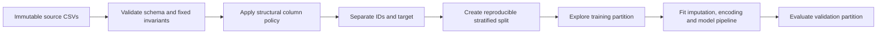

# Stage 1 data preparation: decisions and next steps

## Working on

Build a reusable structural data-preparation layer for the Pump It Up project
before further exploratory analysis, missing-value treatment or modelling. The
layer will remove known superfluous columns, preserve submission identifiers and
fail when the source data no longer supports an agreed removal.

The immediate implementation starts in [`src/`](../src/). Creating that folder
was Step 1 and is complete. Step 2 is the first code change.

## Course scope established on 14 August 2026

Stage 1, including the Pump It Up work, provides optional practice and portfolio
evidence. The course labels the Module 3 to 9 activities as self-study capstone
components, and the Module 6 introduction says that these activities do not count
towards programme completion. The overview also says elsewhere that Stage 1 runs
through Module 11, so the published boundaries conflict.

The required capstone begins in Module 12 with the shared black-box optimisation
challenge. Modules 12 to 24 require numeric queries and progress records. The
Module 25 submission asks for a GitHub repository containing runnable, commented
code, a data sheet, a model card, a non-technical write-up, a README linking to
large data rather than storing it, and relevant supporting material.

Later Stage 2 pages remain locked. The pages available at this date do not state
a minimum model score or formal quality threshold. They support a cautious
working interpretation: the course requires a complete, documented Stage 2
attempt; stronger results determine presentation or distinction opportunities.

Evidence:

- [Capstone project overview](https://classroom.emeritus.org/courses/18642/pages/capstone-project-overview?module_item_id=3236688)
- [Module 6 discussion](https://classroom.emeritus.org/courses/18642/discussion_topics/969793?module_item_id=3237005)
- [Course module list](https://classroom.emeritus.org/courses/18642/modules)

The Module 6 discussion post records the Stage 1 ambiguity and explains that
Pump It Up was selected as an interesting data set, rather than as a commitment
to enter the competition. Other learners reported similar uncertainty about
project choice.

## Evidence already collected

The notebooks contain the current audit work:

- [`01-data-audit.ipynb`](../notebooks/01-data-audit.ipynb) contains the broader
  data audit.
- [`01-data-audit-amount_tsh.ipynb`](../notebooks/01-data-audit-amount_tsh.ipynb)
  contains the focused `amount_tsh` analysis.

The duplicate-column audit covered both feature files:

| Data set | Rows | Source columns |
| --- | ---: | ---: |
| Training values | 59,400 | 40 |
| Test values | 14,850 | 40 |

### Duplicate and near-duplicate findings

| Category | Finding in training data | Finding in test data | Decision |
| --- | --- | --- | --- |
| Duplicate column labels | None | None | No action |
| Same values, row for row | `quantity` equals `quantity_group` | Same result | Keep `quantity`; drop `quantity_group` |
| Same information under different labels | `payment` and `payment_type` form a one-to-one relabelling | Same result | Keep `payment_type`; drop `payment` |
| More than 99.5% one repeated value | `recorded_by` is 100% `GeoData Consultants Ltd` | Same result | Drop `recorded_by` |
| Other column pairs above 99.5% row agreement | None | None | No action |

The payment mapping was stable in both files:

| `payment` | `payment_type` |
| --- | --- |
| `pay annually` | `annually` |
| `pay monthly` | `monthly` |
| `pay per bucket` | `per bucket` |
| `pay when scheme fails` | `on failure` |
| `never pay` | `never pay` |
| `other` | `other` |
| `unknown` | `unknown` |

`extraction_type` and `extraction_type_group` had the highest remaining literal
agreement: 95.843% in training and 95.684% in test. This falls below the 99.5%
threshold. `num_private` contained zero for about 98.73% of training rows and
98.69% of test rows, so it also falls below the threshold.

Several column families encode deterministic hierarchies:

- extraction type, group and class;
- management and management group;
- water quality and quality group;
- source, source type and source class;
- waterpoint type and waterpoint group.

These hierarchies may help models at different levels of granularity. Keep them
until training-partition analysis or validated model comparisons justify a
removal.

## Settled structural policy

Apply the same fixed policy to training and test features:

| Source column | Treatment | Reason |
| --- | --- | --- |
| `quantity` | Keep | Preferred descriptive field |
| `quantity_group` | Drop | Row-for-row duplicate of `quantity` |
| `payment_type` | Keep | Preferred compact field |
| `payment` | Drop | One-to-one relabelling of `payment_type` |
| `recorded_by` | Drop | Constant in both supplied feature files |
| `id` | Preserve as metadata | Required for joins and competition submissions; exclude from predictors |

The 40 source columns therefore produce 36 model predictors. Three source
features leave the feature matrix, and `id` moves to metadata.

## Pipeline boundary

The project will recreate canonical data from the untouched competition CSV
files on each run. Do not create or maintain cleaned CSV copies.

Structural preparation may inspect schema and agreed equivalence rules. It must
not calculate means, modes, frequencies, target correlations or other learned
statistics. Imputation, encoding and model transforms must fit on the training
partition or current cross-validation fold.

Generic duplicate and constant-column discovery belongs in an audit report. It
must not drop new columns from test data or change the feature policy without a
reviewed decision.

## Required safeguards

The structural layer must stop with a clear error if any of these conditions
fails:

1. Required columns are missing or the input schema has changed.
2. `id` contains nulls or duplicates.
3. `quantity` and `quantity_group` differ, including their missing-value pattern.
4. A `payment` value does not map to the expected `payment_type` value.
5. `recorded_by` contains a value other than the agreed constant.
6. Prepared training and test predictors have different ordered schemas.

The preparation functions must preserve row count and row order, and they must
not mutate caller-owned data frames.

## Fit with the course ten-step plan

The written report can retain the course headings while the implementation uses
an earlier split to prevent leakage.

| Course step | Project treatment |
| ---: | --- |
| 1. Clarify goals and scope | Define the three-class prediction question, metric and Stage 1 practice scope. |
| 2. Gather data | Load immutable feature and label files, join labels by `id`, and record provenance. |
| 3. Explore, scale and preprocess | Audit structure, apply the fixed column policy, then create the stratified split. Scaling waits until a selected method needs it. |
| 4. Handle missing values and outliers | Diagnose using the training partition. Fit every treatment inside the model pipeline. |
| 5. Remove irrelevant or unavailable variables | Explain the fixed removals and any later evidence-led removals. The code performs safe structural removals earlier so later work uses one canonical schema. |
| 6. Encode categorical variables | Fit encoders inside each training fold. Handle unseen validation or test categories. |
| 7. Create features | Add only features with a stated rationale and validation evidence. |
| 8. Determine the task | Record multiclass classification as the formal task. |
| 9. Split the data | Document the split created after structural preparation, including seed and stratification. |
| 10. Select methods | Start with a transparent baseline, then compare a decision tree and a tree ensemble. |

The course transcript groups the same work into broader stages: purpose, data,
exploration and cleaning, feature work, task choice, splitting, method choice,
application, interpretation and deployment. The report can cross-reference that
version without changing the execution order.

## Implementation sequence

1. **Complete:** create [`src/`](../src/) for reusable project code.
2. **Next:** add `src/data_preparation.py` with loading, schema checks, fixed
   invariant checks, canonical column selection, separation of identifiers and
   target, and a preparation report that records each removal.
3. Add `tests/test_data_preparation.py`. Cover row count and order, lack of input
   mutation, the 36-predictor contract, matching train/test schemas and deliberate
   invariant failures.
4. Update `01-data-audit.ipynb` to call the shared preparation code and display
   its report instead of copying the removal logic into notebook cells.
5. Add the learned preprocessing and estimator pipeline in a separate module,
   such as `src/modelling.py`, after the structural layer passes its tests.
6. Realign the Stage 1 README and notebooks with the ten course headings once the
   executable workflow exists.

Use the repository's current Python environment. Inspect the available test and
packaging tools before adding configuration or dependencies. If the environment
lacks a suitable test runner, agree the smallest project setup before installing
one.

## Acceptance criteria for Step 2

- One function or small set of functions prepares either feature data set using
  the same policy.
- Calling the preparation code twice with the same input gives the same ordered
  result.
- The result contains 36 predictors plus a separately returned `id` series.
- Training and test predictors share the same ordered columns.
- The code reports why it removed each column.
- A changed duplicate relationship or constant column causes a useful failure.
- The code learns no statistics from training, validation or test values.

## Decisions deferred

- Missing-value representation and imputation strategy.
- Treatment of high-cardinality categorical fields.
- Geographic and date feature engineering.
- Removal of hierarchy columns after model comparison.
- Model selection, tuning ranges and competition submission.

These choices require training-partition evidence. The structural preparation
work can proceed without them.

## Resume point

Start with Step 2. Inspect the two audit notebooks for current loading conventions,
then implement the smallest `data_preparation.py` interface that satisfies the
safeguards and acceptance criteria above. Keep the first change limited to the
structural layer and its focused tests.
