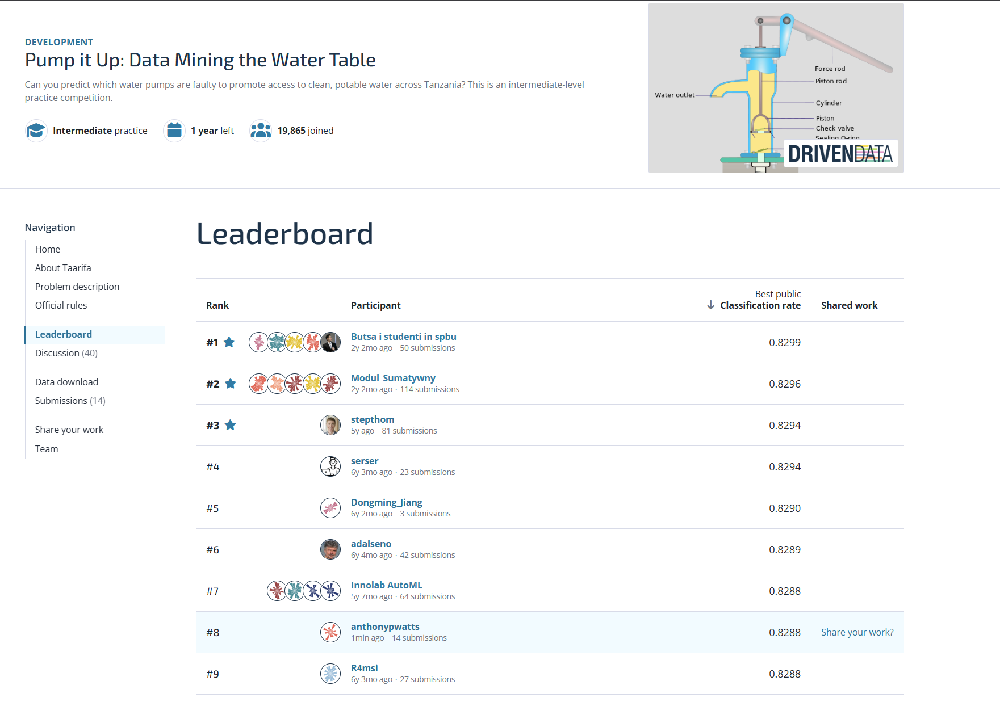

# Model-search conclusion

## Decision

**Further 23 August update:** a bounded follow-up replaced the prepared deep
candidate's seed 20260822 with the already-predeclared seed 20260824. The
unchanged 600-tree recipe reaches **81.8981%** on development and **81.3973%**
on the used local test, adding ten and five net correct rows. Exact-date,
residual-voter and inner-stopping alternatives were rejected. The replacement
CSV is prepared but not uploaded; see the
[deep follow-up report](deep-follow-up-search.md).

**Subsequent 23 August update:** the held final submission slot was explicitly
reopened for the strongest recorded near-miss. The unchanged single-seed
depth-17 XGBoost archive substitution confirmed at **81.3552%** on the used
local test, **+0.1684 percentage points** and 20 net correct rows above the
submitted archive. A validated full-data candidate is now prepared but not
uploaded. See the
[deep-archive confirmation](deep-archive-confirmation.md). The conclusion
below records the earlier stopping decision and why the candidate had
originally been held.

Conclude the bounded Pump It Up model search with the fixed archive synthesis
as the selected competition model. It scored **0.8288** publicly, exceeded the
0.826 project target and was observed at public-leaderboard position **8** on
23 August 2026. The rank is a time-specific observation and may change as
other competitors submit.

*Public leaderboard observed on 23 August 2026; the linked live ranking may
change.*

The original aspiration was approximately one additional percentage point of
frozen validation accuracy. That exact magnitude was not reached: archive
synthesis improves the accepted 81.6246% development result to **81.7929%**,
an increase of **0.1683 percentage points**. The search nevertheless delivered
a reproducible competition improvement, coherent development/local/public
ordering and a top-eight public result. Further selection on the repeatedly
used folds now carries more overfitting risk than evidential value.

## Course-aligned lifecycle

| Step | Final position |
| --- | --- |
| 1. Define the goal and scope | Improve three-class competition accuracy through bounded, reproducible experiments while retaining repair-case interpretation. |
| 2. Gather the data | Use the supplied labelled and competition tables; external-data proposals were not used. |
| 3. Explore the data | Audit predictors, geography, class imbalance, identities, uncertainty, regional effects and representation diversity. |
| 4. Clean and preprocess the data | Keep all transformations fold-fitted; bounded training-only outlier filters were tested first and rejected when they reduced unchanged-fold accuracy. |
| 5. Select and engineer features | Retain accepted features and add only representations supported by frozen-fold evidence: complete identities, categorical occurrence support and spatial-height reconstruction. |
| 6. Define the machine-learning task | Preserve nominal three-class probabilistic classification scored by accuracy; binary-only and fuzzy-label alternatives were evaluated but rejected. |
| 7. Partition the data | Use one fixed 20% local test and five fixed stratified development folds; do not reopen either for post-result tuning. |
| 8. Select and train candidate methods | Screen tree, boosting, neural, ordinal, regional and ensemble candidates under bounded gates and fixed recipes. |
| 9. Evaluate and interpret the results | Archive synthesis led development at 81.7929%, local test at 81.1869% and the public leaderboard at 0.8288. |
| 10. Deploy and iterate | Retain the validated full-data archive CSV as the selected model; stop adaptive modelling and record private-leaderboard performance when available. |

## Final evidence

| Measure | Earlier reference | Selected result | Change |
| --- | ---: | ---: | ---: |
| Frozen development accuracy | 81.6246% accepted vote | **81.7929%** | +0.1683 pp |
| Used local-test accuracy | 80.8333% source-plus-class leader | **81.1869%** | +0.3536 pp |
| Public score | 0.8246 former leader | **0.8288** | +0.0042 |
| Project public target | 0.8260 | **0.8288** | +0.0028 |

The complete-identity companion scored 81.7403% on development, 81.0859% on
the local test and 0.8259 publicly. Its consistent second-place ordering is an
independent check that the archive synthesis margin is not solely a leaderboard
accident.

## Stop rationale

The third 23 August submission slot remains unused. The strongest unconfirmed
deep-XGBoost result missed its predeclared promotion gate, and later spatial,
occurrence, ordinal and seed-bag variants did not improve the selected archive
recipe. Spending the slot or tuning against the two new public scores would
weaken the validation discipline without independent supporting evidence.

The exact submitted files, hashes, component weights and public scores are in
the [submission log](../submissions/README.md).
